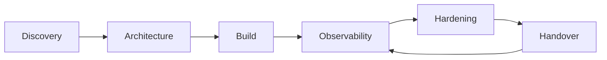

  

## About
I design and deliver reliable systems for teams that need fast execution without compromising maintainability.

My work combines:
- robust backend engineering
- automation workflow integration
- observability-first operations
- security-aware implementation patterns

## Professional Experience
- **James Cook University (Townsville)** — Senior Software Engineer, Research Team *(2.5 years)*
  - Delivered research-facing systems for thesis and publication workflows.
  - Built SQL/EPrint-backed capabilities for reliable academic data retrieval and operations.
- **UI Enlyte (Frankfurt am Main)** — Blockchain / Full-Stack Developer *(2 years)*
  - Built production features across frontend, backend, and blockchain-connected workflows.
  - Improved delivery speed through clean architecture and implementation discipline.

## Delivery Model

## Current Direction
I am actively building toward a stronger **Cybersecurity + AI Automation** positioning through practical engineering work:
- cyber-aware monitoring and integration workflows
- AI-agent orchestration patterns with human-in-the-loop controls
- incident visibility, auditability, and production reliability

## Featured Case Studies
- **AI Automation Command Center**
  - n8n orchestration + AI agents + approval workflow + audit trail
  - Repo: [ai-automation-command-center](https://github.com/PierreDaguier/ai-automation-command-center)
- **Event-Driven Automation Platform**
  - secure webhooks + queue workers + retries/DLQ + observability
  - Repo: [event-driven-automation-platform](https://github.com/PierreDaguier/event-driven-automation-platform)
- **Go Service Template Pro**
  - clean architecture service template + ops dashboard + telemetry stack
  - Repo: [go-service-template-pro](https://github.com/PierreDaguier/go-service-template-pro)
- **Observability Command Center Demo**
  - logs/metrics/traces correlation + incident storytelling
  - Repo: [observability-command-center-demo](https://github.com/PierreDaguier/observability-command-center-demo)

## Core Stack
**Languages:** Go, Python, TypeScript, JavaScript

**Systems:** REST/OpenAPI, GraphQL, Microservices, RabbitMQ

**Data:** PostgreSQL, MariaDB, MongoDB

**Ops:** Docker, CI/CD, Prometheus, Grafana, Linux, Nginx, Apache

**Automation:** n8n, event-driven integrations

## GitHub Signals

  
  

  

## Availability
Open to freelance collaborations on:
- backend systems
- workflow automation and API integrations
- observability and reliability engineering

---

  Built with signal-over-noise mindset.

